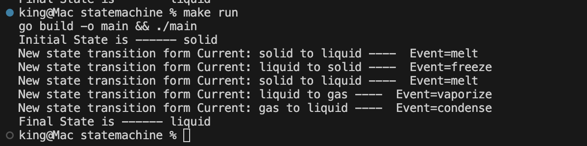

# State Machine

## Usage

```go
  const (
    MELT = "melt"
    VAPORIZE = "vaporize"
    FREEZE = "freeze"
    CONDENSE = "condense"
  )

  func main() {
    fsm := NewFSM()

    // create states
    solid := fsm.StartState("solid")
    liquid := fsm.AddState("liquid")
    gas := fsm.AddState("gas")

    // create events
    meltEvent := Event(MELT)
    vaporizeEvent := Event(VAPORIZE)
    freezeEvent := Event(FREEZE)
    condenseEvent := Event(CONDENSE)


    fsm.ConnectStates(solid, liquid, meltEvent)
    fsm.ConnectStates(liquid, solid, freezeEvent)

    fsm.ConnectStates(liquid, gas, vaporizeEvent)
    fsm.ConnectStates(gas, liquid, condenseEvent)

    fmt.Printf("Initial State is ------ %s\n", fsm.PresentState.String())

    events := []string{MELT, FREEZE, MELT, VAPORIZE, CONDENSE}
    fsm.ComputeAndPrint(events)

    fmt.Printf("Final State is ------ %s\n", fsm.PresentState.String())
  }
```



## NOTES

There are different types of state-machine

* Finite State Machine

Real world examples of FSM are;

* Airflow DAGs,
* Kubernetes Job controller,
* AWS Step Functions

## Resources

* [Finite State Machine](https://medium.com/data-science/writing-a-finite-state-machine-in-go-e5535e89d615)
